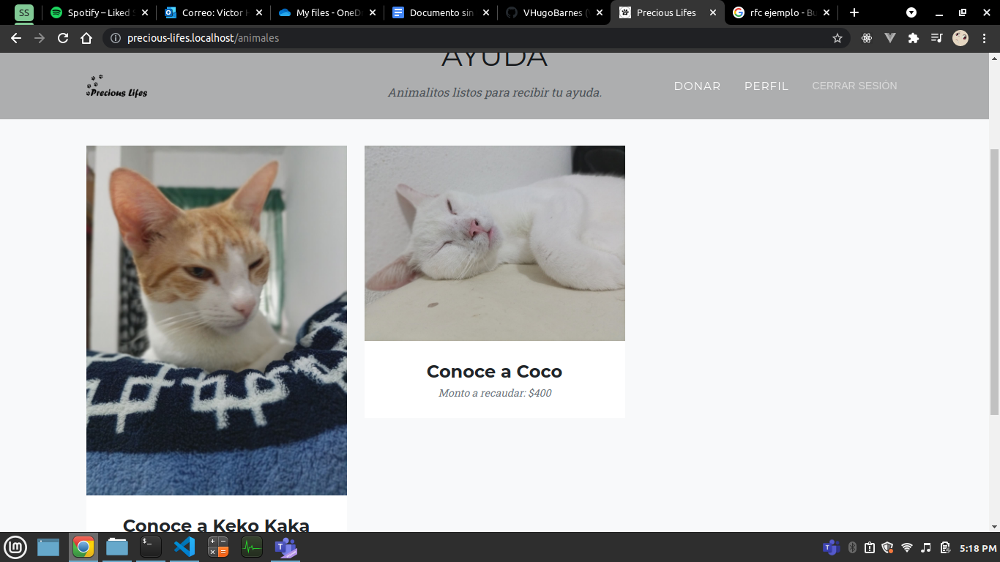
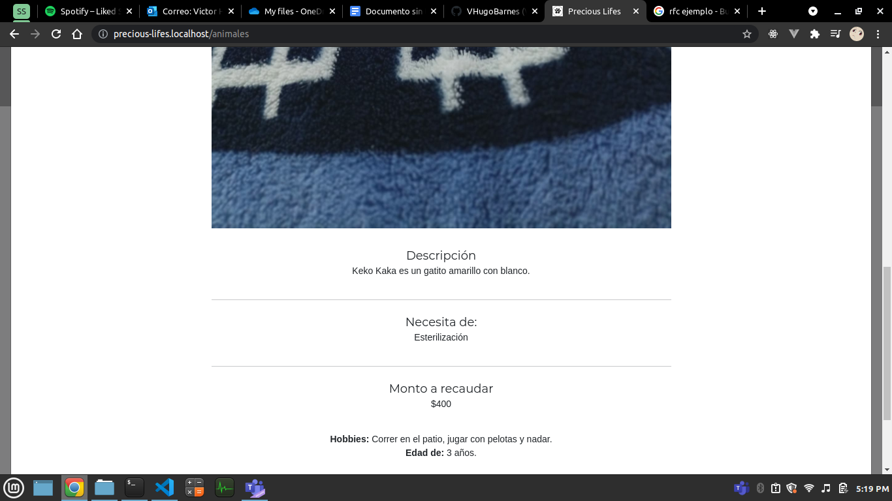

# Precious Lifes
Repositorio oficial del proyecto precious lifes.

# Acerca del proyecto
Precious lifes es un proyecto sin fines de lucro que permite a veterinarias recibir donaciones de usuarios voluntarios para ayudar a esterilizar y/o sanar padecimientos que tengan los animalitos de la calle.    
El objetivo de Precious Lifes es el de terminar de una manera no invasiva o violenta la sobrepoblación de animales en las calles, así evitando que los animalitos tengan que vivir en la calle.

Este es un prototipo para la clase de programación web, por lo tanto algunas funciones como la de realizar pagos no están implementadas, también como otras funciones básicas de cualquier sistema web, esto por las limitantes del equipo de trabajo y los contenidos de la materia.

# Imágenes del proyecto

## Pantalla principal

## Registro de veterinarios

## Pantalla con sesión iniciada

## Registro de usuarios

## Vista del perfil de usuarios

## Vista del perfil de veterinarios

## Edición de datos de usuario

## Vista de animalitos registrados

## Vista detallada del animalito

## Vista de Donación

## Registro de animalito (Para veterinarios)

# Como contribuir
1. Primero que nada tienes que asegurarte que te haya añadido como colaborador.
2. Instalar composer. [Lo puedes descargar aquí](https://getcomposer.org/download/), buscar el instalador para Windows, es cuestión de darle siguiente y siguiente.
3. Tener instalado Node.js. [Lo puedes descargar aquí](https://nodejs.org/en/).
4. Tener instalado git en tu máquina local. [Lo puedes descargar aquí](https://git-scm.com/)
    1. Una vez instalado git (asumiendo que estás usando Windows) abre git bash (es una terminal hecha para git) y escribe los siguientes comandos reemplazandolo con tus datos: `git config --global user.email "tucorreo@mail.com"` `git config --global user.name "Tu Nombre Completo". El correo con el que te registraste en GitHub debe ser el mismo que coloques en la terminal.
    2. Las extensiones de PHP necesarias para activar son `OpenSSL`, `PDO`, `mbstring`, `tokenizer`, `xml`, `ctype`, `json`, `curl`.
5. Dirigete a la carpeta donde quieras tener alojado el proyecto (de preferencia donde tengas instalado tu servidor Apache o nginx, o sea en la carpeta www en caso de que tengas AppServ, XAMPP, etc) y escribe el siguiente comando dentro de dicha carpeta `git clone https://github.com/VHugoBarnes/precious-lifes.git`.
6. Dirigete a la carpeta del repositorio, y ejecuta: `composer install`, `npm install`, `cp .env.example .env`, `php artisan key:generate`.
7. Crea una base de datos en MySQL llamada `precious_lifes`.
8. Edita el archivo `.env` con los datos de la base de datos en MySQL (líneas 13 a 15).
9. Corre las migraciones con el comando `php artisan migrate:fresh`.

# Funciones que realiza
- Registro e inicio de sesión de usuarios.
- Vista para cambiar datos de usuario.
- Veterinarios dan de alta animales.
- Vista para ver animales.
- Vista para ver un solo animal.
- Ruta para donar (Recoge datos bancarios).